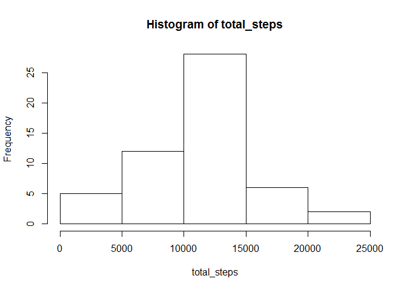
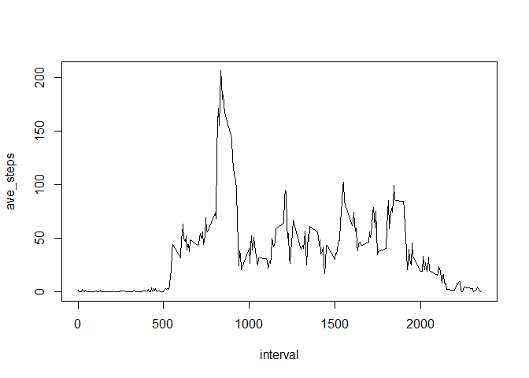
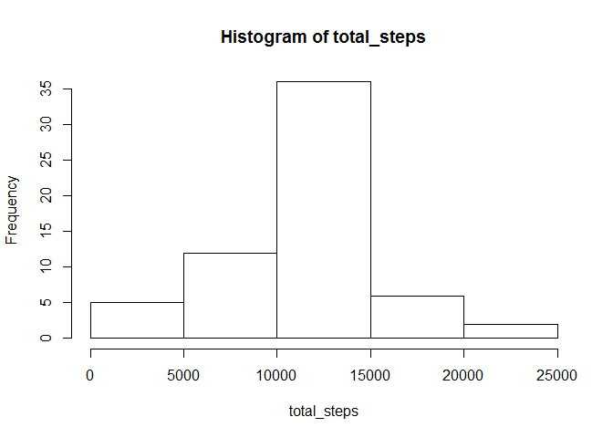

# Reproducible Research: Peer Assessment 1


## Loading and preprocessing the data

```r
library(dplyr)
```

```
## Warning: package 'dplyr' was built under R version 3.1.1
```

```
## 
## Attaching package: 'dplyr'
## 
## The following objects are masked from 'package:stats':
## 
##     filter, lag
## 
## The following objects are masked from 'package:base':
## 
##     intersect, setdiff, setequal, union
```

```r
unzip("activity.zip")
data <- read.csv("./activity.csv") 
```

## What is mean total number of steps taken per day?

```r
data1 <- group_by(data, date)
data2 <- summarize(data1, total_steps = sum(steps))
with(data2, hist(total_steps))
```

 

```r
mean(data2$total_steps, na.rm = T)
```

```
## [1] 10766.19
```

```r
median(data2$total_steps, na.rm = T)
```

```
## [1] 10765
```

## What is the average daily activity pattern?

```r
data3 <- group_by(data, interval)
data4 <- summarize(data3, ave_steps = mean(steps, na.rm = T))
with(data4, plot(interval, ave_steps, type = "l"))
```

 

```r
a <- data4[which.max(data4$ave_steps),1]
```
The interval with the largest number of steps is 835


## Imputing missing values

```r
total_missing <- sum(is.na(data$steps))
data5 <- data
data5$steps[is.na(data5$steps)] <- mean(data5$steps, na.rm = T)
data5 <- group_by(data5, date)
data6 <- summarize(data5, total_steps = sum(steps))
with(data6, hist(total_steps))
```

 

```r
mean(data6$total_steps)
```

```
## [1] 10766.19
```

```r
median(data6$total_steps)
```

```
## [1] 10766.19
```
Total number of missing values is 2304
There's no impact on the data of imputing missing values because the missing values were imputed in a very rough fashion.

## Are there differences in activity patterns between weekdays and weekends?

data7 <- mutate(data6, weekday = weekdays(data))
head(data7)

